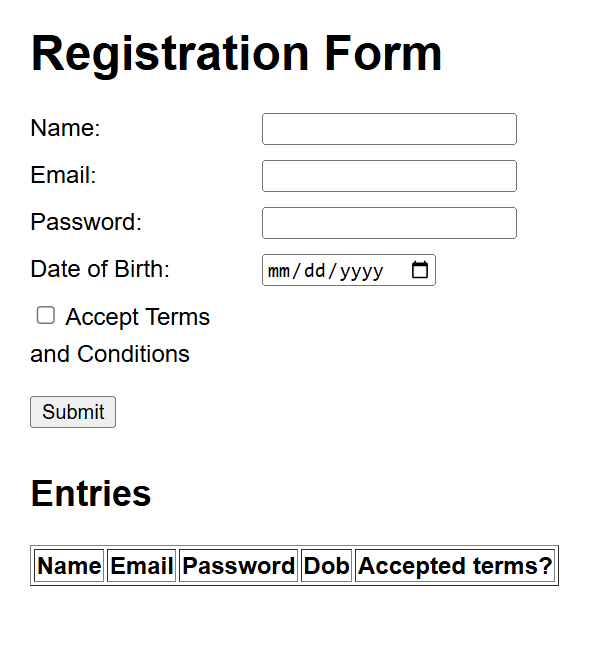

# wd101

---

## 🧠 Validation Logic

DOB validation ensures that the user is between 18 and 55 years old. This is implemented using JavaScript by comparing the user's birthdate with the current date.

---

## 🚀 How to Deploy on GitHub Pages

1. Push your project to a GitHub repository.
2. Go to your repo → **Settings** → **Pages**
3. Under "Source", select:
   - Branch: `main`
   - Folder: `/ (root)`
4. Click **Save**
5. GitHub will provide a link like:  
   `https://<username>.github.io/<repository-name>/`

---

## 🧪 Requirements Checklist

✅ Form with fields: `name`, `email`, `password`, `dob`, and `terms checkbox`  
✅ Validates DOB between 18–55 years  
✅ Table headers: `Name`, `Email`, `Password`, `Dob`, `Accepted terms?`  
✅ Displays `true` or `false` in "Accepted terms?"  
✅ Uses `localStorage` to persist entries  
✅ Hosted using GitHub Pages  
✅ Includes `<button type="submit">`  

---

## 📸 Screenshot

  

---

## 🛠 Tech Stack

- HTML5
- CSS3
- JavaScript (ES6)
- GitHub Pages

---

## 📬 Author

**Your Name**  
GitHub: [@Moukhika](https://github.com/Moukhikaa)

